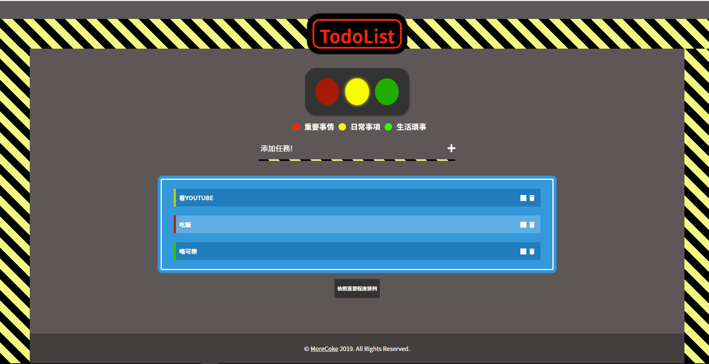

<h1 align="center">嗨 歡迎來到我的Github</h1>

## 這次嘗試做了一個簡單的TodoList，其中主要設計、練習有:
1. 響應式設計，嘗試手刻不用bootstrap
2. Scss函式練習
3. css的內建動畫特效
4. 封鎖條的設計和絕對定位
5. 偽元素刪除線的練習
6. 利用flex製作沉底的footer
7. js Localstorage的練習
8. classList 的add() 、remove() 、toggle() 、contain() 之應用
9. addeventLister 監聽現有元素，更新表單的增減的動態
10. dataset的應用，搭配事件e抓取點擊資料陣列中的值
11. 任務重要程度排列，點擊紅綠燈按紐，利用switch增加該筆資料中的物件order，最後利用order的數字進行sort()

***

## 以下是參考的資料
1. [Stripes in CSS](https://css-tricks.com/stripes-css/)
2. [Sorting Arrays in JavaScript (Array.prototype.sort)](https://www.youtube.com/watch?v=BbuLjEqFlw0)
3. [Why does points.sort(function(a, b){return a-b}); return -1, 0 or 1?](https://stackoverflow.com/questions/24768492/why-does-points-sortfunctiona-breturn-a-b-return-1-0-or-1)
4. [In Javascript, how to conditionally add a member to an object?](https://stackoverflow.com/questions/11704267/in-javascript-how-to-conditionally-add-a-member-to-an-object)
5. [How can I add a key/value pair to a JavaScript object?](https://stackoverflow.com/questions/1168807/how-can-i-add-a-key-value-pair-to-a-javascript-object)
6. [javascript排序return a-b?](https://www.zhihu.com/question/22781233)
7. [Array.prototype.sort()](https://developer.mozilla.org/zh-CN/docs/Web/JavaScript/Reference/Global_Objects/Array/sort)

***

## 以下是參考的Codepen
1. [Hexschool - JS -107 HW - ToDoList](https://codepen.io/cleosyuu/pen/EqaXLN)
2. [Vue TODOLIST](https://codepen.io/nikolausliu/pen/NjOvrb)
3. [ToDoList](https://codepen.io/beezeecode/pen/EvmBGo)
4. [traffic-light](https://codepen.io/dervondenbergen/pen/jCqzl)

***

大概是這樣，這個小東西花了我大約48小時，真正寫code的時間可能不到四小時，剩下的時間都在學新技巧和DEBUG(還有平復抓不到BUG煩躁的心情?)，希望下次練習能更快完成、更進入狀況!!